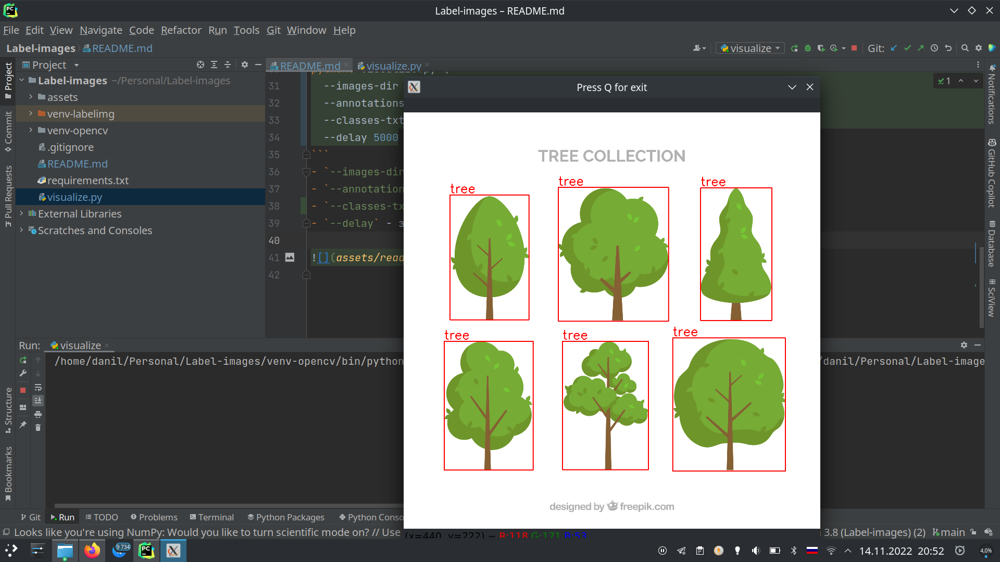

# Разметка изображений
Как размечать изображения для задачи детекции объектов?

### Установка LabelImg

Официальный репозиторий - [LabelImg](https://github.com/heartexlabs/labelImg).

```bash
# установка Python
sudo apt install python3 python3-venv
# создание виртуального окружения
python3 -m venv venv
# активация виртуального окружения
source venv/bin/activate
# обновление pip
pip3 install --upgrade pip
# установка зависимостей (labelImg и opencv-python)
pip3 install -r requirements.txt
# запуск LabelImg
labelImg
```

### Настройка LabelImg

[](https://youtu.be/H6YZkKpGJK4)

### Визуализация аннотаций в Python

```bash
python3 visualize.py --images-dir assets/example-dataset/images/ --annotations-dir assets/example-dataset/annotations/ --delay 5000
```
- `--images-dir` - путь до папки с изображениями
- `--annotations-dir` - путь до папки с аннотациями
- `--delay` - задержка между изображениями в миллисекундах


